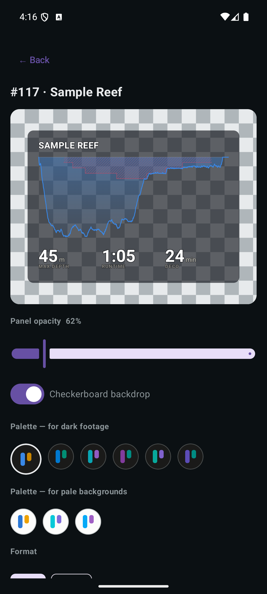

# Dive Slate

[](https://github.com/paul-charp/Dive-Slate/actions/workflows/ci.yml)
[](https://github.com/paul-charp/Dive-Slate/releases/latest)

An Android app that turns a dive log into a **transparent slate** — a compact
badge of your profile to drop over a photo or video.


*The actual export: a transparent PNG, 3240×1404, no background. What you see
behind the corners is this page.*

Share a dive out of Subsurface-mobile, pick a palette, and save it to your
gallery or send it wherever you want it. About three taps end to end.

## The app

| Wide | Tall |
|---|---|
|  |  |

The preview sits on a checkerboard because the output has no background — that
is the product, and a solid backdrop would hide the one property that matters.

Takes a **Subsurface** (`.ssrf`) or **UDDF** (`.uddf`) log — shared in from
Subsurface-mobile, picked out of your files, or the bundled sample — lists the
dives newest first, then previews the chosen one and exports it. A single-dive
log skips the list.

The slate itself is a profile silhouette, the site name, and a few big numbers.
No axes and no legend: at a third of frame width on a phone those are unreadable
noise rather than information.

Wide and Tall span the frame and lead with the profile. The other two are corner
badges, for footage that is doing its own talking: **Compact** (460 × 388) puts
depth and runtime first, side by side, with the profile cut to a strip beneath
them, and **Watch** (400 × 459) is smaller and square-ish, stacking the two
figures so each gets the full width — which is how a badge a third of the frame
carries numerals larger than the layout spanning all of it.

Each layout states how many figures it has room for: four for Wide and Tall, two
for the badges, since their columns split a much narrower slate. The picker shows
the budget and greys out the rest rather than dropping the overflow when it
draws.

The look is chosen along three axes, broadest first:

| | what it decides | choices |
|---|---|---|
| **Style** | how the slate is drawn — the art direction | `modern` |
| **Layout** | how it is proportioned — where things go, how big | Wide, Tall, Compact, Watch |
| **Theme** | what colour it is | nine palettes, see [Themes](#themes) |

They compose: every layout works with every style. A style carries its own
palettes, because a palette is validated against the marks it will be painted
as — so picking a style is what decides which themes are on offer.

Also adjustable: which elements appear, which figures are shown, and the scrim
panel's opacity.

**The opacity control moves the panel and nothing else.** Ink is never faded, and
the slider is clamped to a per-theme floor computed from ink contrast against the
worst possible backdrop. Fading the marks would void the contrast the palette
gates enforce and turn the deliberately-unthemed hazard red into a pink
suggestion.

**Save to gallery** writes the transparent PNG to Pictures › Dive Slate,
confirmed with a snackbar because a MediaStore write is otherwise silent and
lands in an album you are not looking at. **Share** hands the same file to the
system chooser — a transparent PNG is as useful in a video editor or a message
as it is in a story.

## Install

Download the APK from the
[latest release](https://github.com/paul-charp/Dive-Slate/releases/latest) and
open it. Android 10 or newer.

It is not on the Play Store, so your phone will ask once whether to allow
installs from wherever you opened the file — a browser or a file manager. Each
release also carries a `.sha256` beside the APK if you want to check the
download by hand.

**The app keeps itself up to date.** Once a day it asks GitHub whether a newer
release exists and offers it to you; the download is verified against the
checksum published in the release before Android is asked to install anything,
and a mismatch is refused rather than installed. Those two requests are the only
thing the app does with the network, and the only reason it asks for internet
access at all.

## The figures on the slate

Two are always shown — max depth and runtime — then whichever of these the log
can answer, up to the limit you set and the number the layout has room for
(four across Wide and Tall, two on the corner badges):

| key | shows | needs |
|---|---|---|
| `depth` | max depth, rounded up to the metre | samples |
| `time` | runtime, rounded up to the minute | samples |
| `deco` | time spent decompressing | a recorded ceiling |
| `gf` | gradient factors, e.g. `70/80` | a deco-model label containing them |
| `used` | gas consumed, litres | cylinder size + start and end pressure |
| `temp` | minimum water temperature | temperature samples |
| `sac` | surface air consumption | the log's own SAC field |
| `cns` | CNS toxicity percentage | the log's own CNS field |
| `avg` | average depth | samples or the logged mean |
| `gas` | mixes breathed, e.g. `Air, O2` | gas-switch events |

A value the log cannot supply is skipped rather than shown blank. A value too
wide for its column — a long list of mixes, mostly — is set smaller so it stays
inside it, rather than being dropped or left to run into its neighbour.

### Two of these are derived, not read

**Deco time** is not a field in any log. It is computed as *from first reaching
the ceiling on the way up, until the obligation clears* — the hang. This is
deliberately not the same as the span during which deco was owed, which begins
the moment the ceiling leaves the surface, usually while you are still on the
bottom. On the reference dive those are 23 minutes and 50 minutes respectively,
and reporting the latter as "deco" would claim fifty minutes of stops that never
happened.

**Gradient factors** are recovered by pattern from a free-text deco-model label
(`GF 70/80`, `ZHL16C GF30/85`, `Buhlmann ZH-L16C + GF 30/85`). Anything that is
not a valid pair of percentages yields nothing rather than a guess — a VPM-B dive
has no gradient factors and must not appear to.

## Themes

Nine, generated and machine-checked rather than chosen. They belong to the
`modern` style, which is the one that paints the marks they were validated
against:

| for dark footage | for pale backgrounds |
|---|---|
| `slate` `reef` `lagoon` `abyss` `twilight` `orchid` | `light` `paper` `ink` |

Each is derived from one base hue: that becomes the depth curve, and the
gas-switch accent is then found by searching the hue circle for the colour that
separates best from both the curve and the deco-ceiling red. Every palette is
validated for colour-vision-deficiency separation, chroma, lightness and contrast
before it ships.

That validation is arithmetic, and it runs **at design time, not on the phone**.
The app ships the answers as constants.

Only hues from roughly **180° to 330°** work — cyan through blue, violet and
magenta. Warm and green bases collide with the fixed red ceiling: a green curve
looks maximally different from red to normal vision (ΔE 24) but measures 2.2
under protanopia.

## Formats

| Format | Extensions | Notes |
| --- | --- | --- |
| Subsurface XML | `.ssrf`, `.xml` | sparse sample attributes are carried forward, as Subsurface itself does |
| UDDF 3.x | `.uddf`, `.xml` | SI units, namespace-agnostic; mandatory deco stops only |

Detection reads file content, not the extension, so a renamed log still works.

## Build

```bash
cd android && ./gradlew :app:installDebug
```

Needs JDK 21 on `JAVA_HOME`, and the Android SDK — `ANDROID_HOME`, or `sdk.dir`
in `android/local.properties`. The wrapper fetches its own Gradle. Android Studio
is **not** required; it is only needed for the IDE and the emulator GUI.

```bash
cd android && ./gradlew core:test          # 52 tests, no device
cd android && ./gradlew :app:assembleRelease
```

With no keystore configured, `assembleRelease` signs with the **shared SDK debug
key** and says so. That is fine for putting a build on your own phone and no use
for distribution — an install signed with it can never be updated by a properly
signed one, because Android identifies an app by its signature. To sign for real,
put `storeFile`, `storePassword`, `keyAlias` and `keyPassword` in
`keystore.properties` at the repository root; it is gitignored, and the build
prints which key it used and which file configured it.

Releases are cut by pushing a `v*` tag; GitHub builds, signs, verifies and
publishes. [docs/RELEASING.md](docs/RELEASING.md) covers the keystore, the
repository secrets, and what each of the pipeline's refusals is protecting
against.

## Repository layout

```
android/       the app. core/ is plain Kotlin/JVM — units, models, both
               parsers, palettes, the styles and layouts — and builds with
               only a JDK. app/ is Compose, the Canvas painter, intents,
               export.

conformance/   the fixtures core/ is tested against: full parsed models for
               each log, a table-driven spec for the unit grammar, synthetic
               deco profiles, and the baked palettes. data/ holds the source
               logs those describe.

tools/         Python, design-time only. The palette maths and the scripts
               that bake it into android/.../Themes.kt, plus the check that
               the release manifest and the app still agree about its fields.
               Nothing here ships.

docs/          RELEASING.md, and the screenshots this page uses.

.github/       CI on every push; a signed release on every v* tag.
```

`core` emits the slate as a **display list**, not as pixels, and `app` merely
paints it. That split is what makes the interesting code testable without a
device — including all of the geometry.

The palette code is Python because it is a **design instrument**: it exists to
prove a palette clears the gates, and having proved it for the nine presets, its
job is done. Porting it would mean shipping a colour-science library on a phone
to recompute a constant.

## Development

`core:test` reads `conformance/`, so a fixture change invalidates the task rather
than reporting up to date — if a green run ever looks too good, `--rerun-tasks`
is the way to check.

Changing a palette means regenerating what the app ships:

```bash
uv run python tools/export_theme_tokens.py
uv run python tools/generate_kotlin_themes.py
```

Then `uv run pytest` to confirm the baked tokens still match the maths, and
`uv run ruff check . && uv run mypy tools`.

`CLAUDE.md` carries the rest: the handful of behaviours that are easy to break,
how a share intent actually arrives, and the reasoning behind decisions that
look arbitrary from the outside. Read it before changing parsing, palettes or
the intent filters.

## Known gaps

- Settings do not persist across launches: style, layout, palette, opacity and
  figure choices reset every time.
- No background-media picker, so the palette cannot yet be judged against your
  own footage — only against the checkerboard.
- No library. Every incoming log is already copied to `filesDir/logs/` with a
  timestamp, and nothing ever reads that directory back — so re-rendering an
  old dive means exporting it from Subsurface again. Surfacing what is already
  being saved is the cheapest real improvement left.

## License

MIT
