<div align="center">


# Dive Slate

**Your dive profile, as a transparent badge you can drop on a photo.**

[](https://github.com/paul-charp/Dive-Slate/actions/workflows/ci.yml)
[](https://github.com/paul-charp/Dive-Slate/releases/latest)
[](#get-it)
[](LICENSE)

[**Download the APK**](https://github.com/paul-charp/Dive-Slate/releases/latest) · [A trip at a time](#a-trip-at-a-time) · [Layouts](#four-layouts) · [Figures](#the-figures) · [Styles](#eight-styles) · [Palettes](#twenty-four-palettes)

</div>

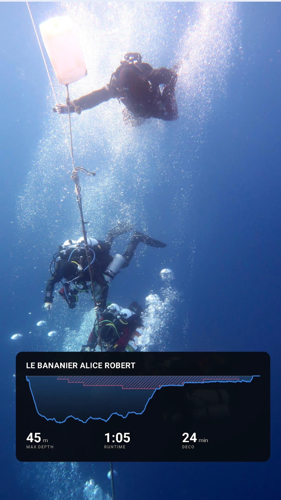

Share a dive out of Subsurface-mobile, pick a look, save it to your gallery.
About three taps end to end.

What comes out is a **transparent PNG** — a profile silhouette, the site name and
a few big numbers, with no background behind them. Drop it on a stop photo, a
video frame or a story and the shot still shows through.

- 🤿 **Reads your real log.** Subsurface (`.ssrf`) or UDDF (`.uddf`), shared
  straight in from Subsurface-mobile or picked out of your files — several
  files at once, if a trip is split across them.
- 🗂️ **A whole trip in one pass.** Pick as many dives as you like and they all
  come out matching, drawn with the settings you chose once.
- 🖼️ **Four layouts.** Full-frame strips, or corner badges small enough to stay
  out of the way of the shot.
- 🎨 **Eight styles, 24 palettes**, each palette machine-checked for
  colour-blind separation and contrast — not eyeballed.
- 📐 **Nothing invented.** A figure your log cannot answer is left off rather
  than guessed at.
- 📏 **Metric or imperial.** Feet and Fahrenheit are your choice, not your dive
  computer's — a log written either way prints either way.
- 💾 **It remembers.** Settle on a look, save it as your default, and every dive
  you share in opens that way.
- 📶 **Works offline.** The only thing it ever asks the network is whether a
  newer release exists.

<br clear="right">

## What you get

<table>
<tr>
<td width="50%">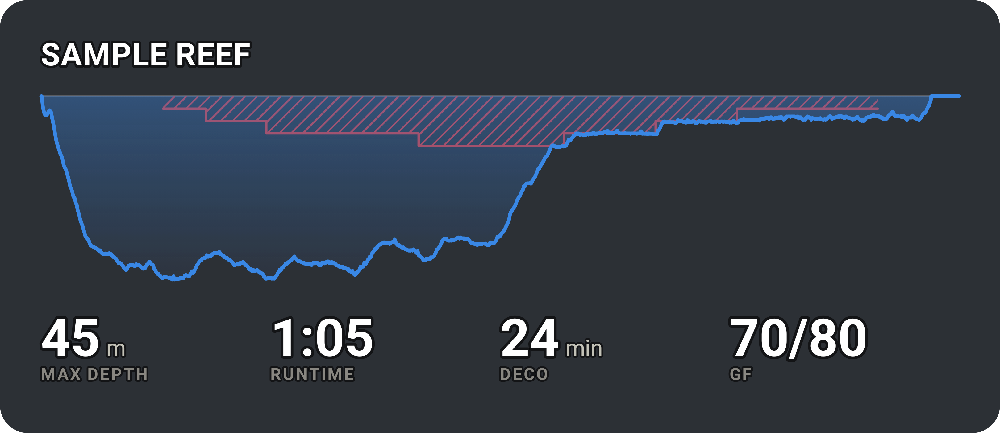</td>
<td>

**The export.** A transparent PNG at 3× — 3240 × 1404 for the Wide layout shown
here. No background is ever painted, so what you can see through the corners is
this page.

That is the whole product, and it is why the preview in the app sits on a
checkerboard rather than on something prettier. A solid backdrop would hide the
one property that matters.

</td>
</tr>
</table>

<table>
<tr>
<td width="28%">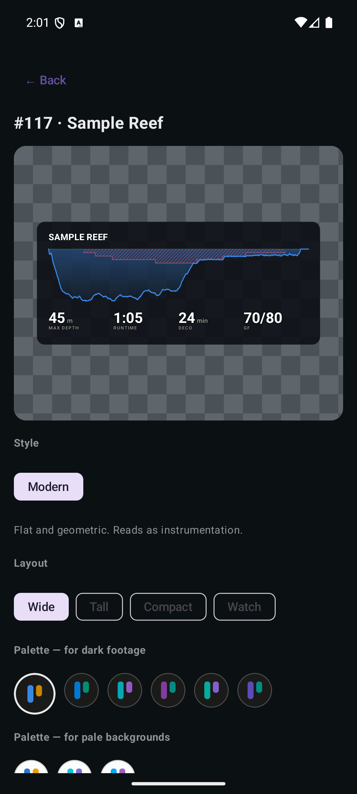</td>
<td width="28%">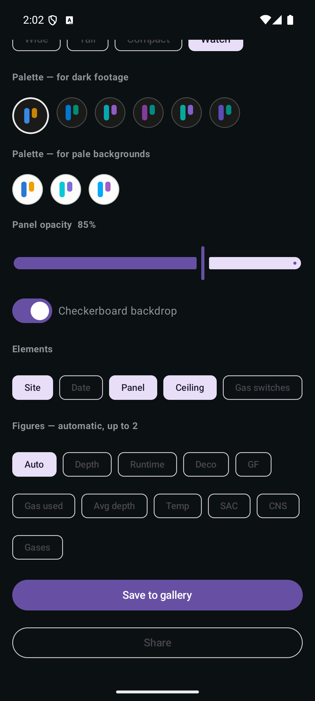</td>
<td>

**The app.** Open a log and it lists the dives newest first, grouped by the file
they came from — a single-dive log skips straight past that. Tap one and you get
the preview, the three look controls, the elements and figures pickers, and an
opacity slider.

Figures are **automatic** by default: the app fills the layout's budget with
whatever your log can answer, best first. Pick your own whenever you would
rather choose.

**Save to gallery** writes the PNG to Pictures › Dive Slate. **Share** hands the
same file to the system chooser, which is as useful in a video editor as it is
in a message.

The app follows **Material You**, so on Android 12+ the accent comes from your
wallpaper — these screenshots show one phone's, not a fixed colour. The slate
itself never changes with it: those palettes were admitted by measured contrast
tests, and a colour picked off a home screen has not been through them.

</td>
</tr>
</table>

## A trip at a time

<table>
<tr>
<td width="34%">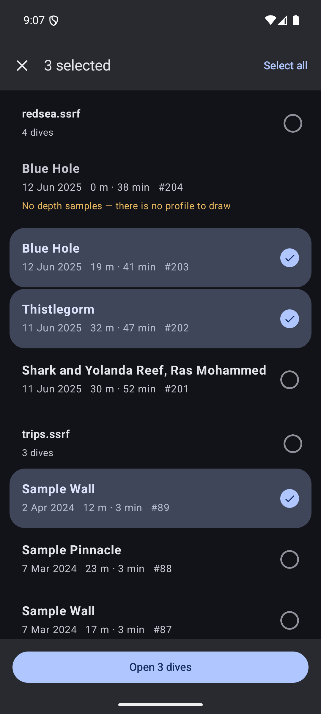</td>
<td>

Hold a dive to start picking, then take as many as you want — **Select all**, or
**All** on a file's heading to take just that trip. Open several files at once
and they stay grouped under the file they came from, so two logbooks never blur
into one list.

The editor previews the picked dives one at a time with `‹ ›` while every
control applies to the whole set, so a trip's slates come out matching rather
than looking like twelve separate exports.

Two things the batch will not hide, because a slate that is quietly missing —
or quietly thinner than the one you designed — is indistinguishable from a log
that never recorded the dive:

- **A dive with no depth samples cannot be drawn.** The list refuses it and says
  so on the row, rather than accepting it and dropping it at export.
- **A figure you picked that the others never recorded** is counted up front —
  *"GF is missing on 3 of 6"* — because you chose it while looking at one dive.

</td>
</tr>
</table>

Each slate lands as its own PNG, named for the export time, the dive number and
the site. Sharing a batch works too, though most apps will only accept an image
or two at once; the gallery takes all of them.

## Four layouts

Pick how much of the frame the slate is allowed to take. All four previews below
are the same frame at the same scale, which is how the app shows them too — so a
corner badge looks like a corner badge before you export it.

<table>
<tr>
<td width="50%" align="center">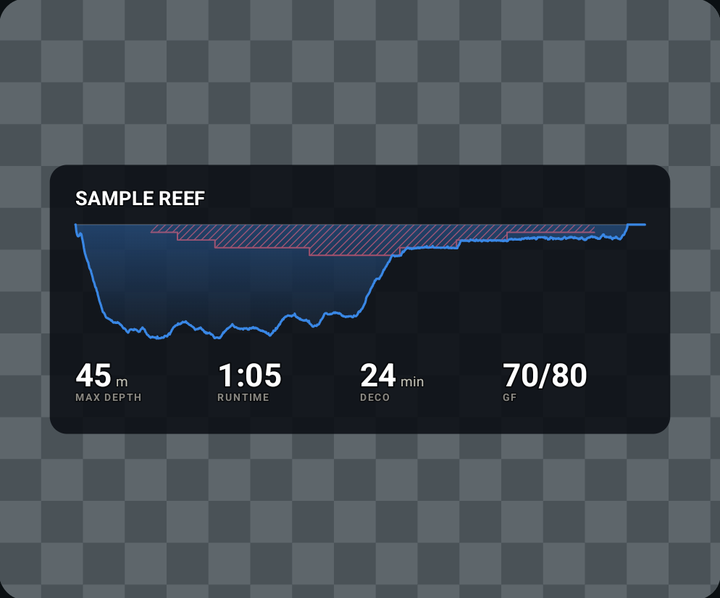<br><strong>Wide</strong> · across the bottom of a 16:9 frame</td>
<td width="50%" align="center">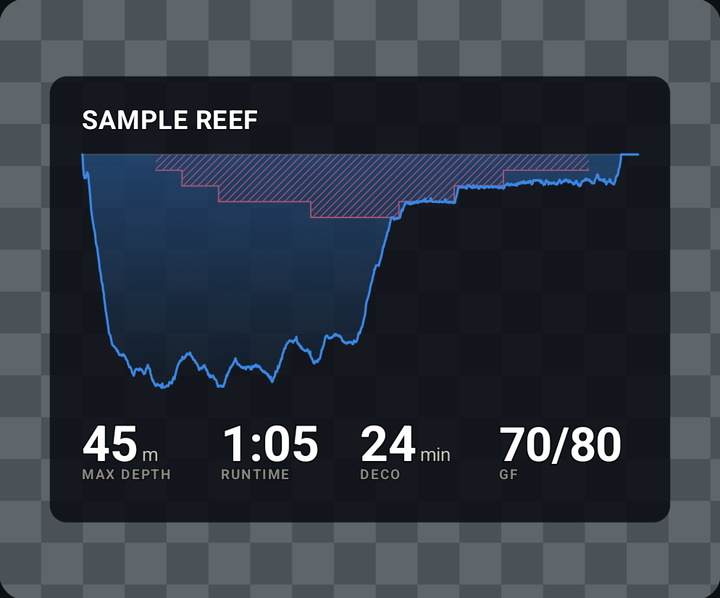<br><strong>Tall</strong> · for a 9:16 story</td>
</tr>
<tr>
<td align="center">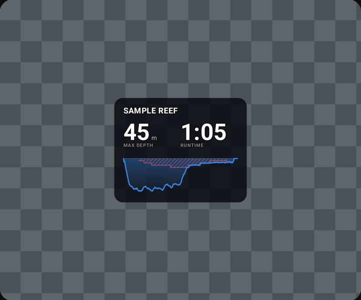<br><strong>Compact</strong> · a corner badge</td>
<td align="center">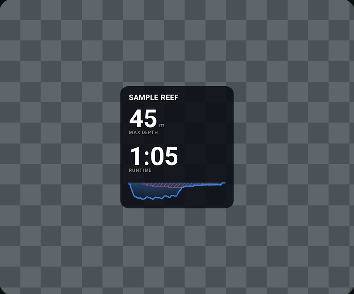<br><strong>Watch</strong> · the smallest, figures stacked</td>
</tr>
</table>

Every layout works with every style and every palette.

| | Size | Figures | Made for |
|---|---|---|---|
| **Wide** | 1080 × 468 → exports **3240 × 1404** | up to 4 | Across the bottom of a 16:9 frame. The profile leads and the numbers caption it. |
| **Tall** | 1080 × 776 → exports **3240 × 2328** | up to 4 | A 9:16 story. The same arrangement, but the profile gets roughly twice the height and the numerals are half again as large. |
| **Compact** | 460 × 362 → exports **1380 × 1086** | 2 | A corner of footage that is doing its own talking. Depth and runtime come first, side by side, with the profile cut to a strip beneath them. |
| **Watch** | 400 × 434 → exports **1200 × 1302** | 2 | The smallest, and roughly square. The two figures stack, so each gets the full width — which is how a badge a third of the frame wide carries **larger numerals than the layout spanning all of it**. |

Sizes are what the reference dive renders to; height follows the content, so a
log with no gas switches sits a little shorter. The corner badges are narrower
than the frame on purpose — narrowing a layout tightens the badge rather than
shrinking what is printed on it.

**Each layout says how many figures it has room for**, and the picker shows the
budget and greys out the rest. Four across Wide and Tall; two on the badges,
whose columns split a much narrower slate — a third column on Compact would be
130px wide, which is not enough for `Air, O2` at a size worth reading. The
trimming happens in front of you rather than at export, because a slate quietly
missing a figure looks exactly like a log that never recorded one.

## Style, layout, theme

Three independent controls, broadest first:

| | what it decides | choices |
|---|---|---|
| **Style** | how the slate is drawn — the art direction | eight, below |
| **Layout** | how it is proportioned — where things go, how big | Wide, Tall, Compact, Watch |
| **Theme** | what colour it is | 24 palettes, 2–9 per style |

They compose: every layout works with every style. A style carries its own
palettes, because a palette is validated against the marks it will be painted
as — so picking a style is what decides which themes are on offer. Every style
offers at least one dark and one light palette, and switching style keeps
whichever you had: that choice is about the footage the slate lands on, which
the incoming style knows nothing about.

Also adjustable: **metric or imperial**, which elements appear, which figures are
shown, and the scrim panel's opacity.

Once it looks right, open the **⋮** menu and **Save as default** — every dive you
open after that starts there. **Restore default** undoes an afternoon's fiddling,
and **Factory reset** goes back to the shipped look and forgets the saved one.
Nothing is saved behind your back: the controls are a scratchpad for the dive in
front of you until you say otherwise.

<details>
<summary><strong>Why the opacity slider only moves the panel</strong></summary>

<br>

The slider moves the scrim panel and nothing else, and it is clamped to a
per-theme floor computed from ink contrast against the worst possible backdrop.

Fading the marks themselves would void the contrast the palette gates enforce
and turn the hazard colour into a suggestion. Two tests hold that line.

A style that paints its own opaque card paints it *as* the scrim, so the slider
still works there — and the floor still binds. On the violet card it stops at
91%, because lime ink needs nearly the whole card to stay legible over bright
footage.

</details>

## Eight styles

Same dive, same figures, eight ways of drawing them. Each below is the Wide
layout in that style's default palette, on the app's checkerboard.

<table>
<tr>
<td width="50%" align="center"><br><strong>Modern</strong> · flat and geometric, reads as instrumentation — the default</td>
<td width="50%" align="center">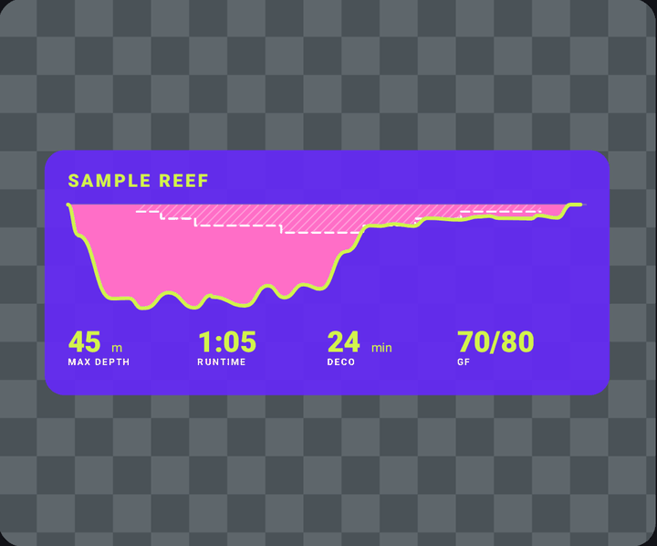<br><strong>Wrapped</strong> · one loud opaque card, made to be posted</td>
</tr>
<tr>
<td align="center">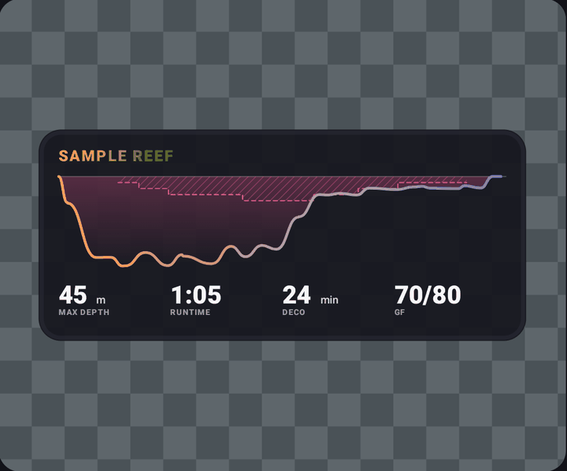<br><strong>Sticker</strong> · rounded and ringed, the profile a warm-to-cool ramp</td>
<td align="center">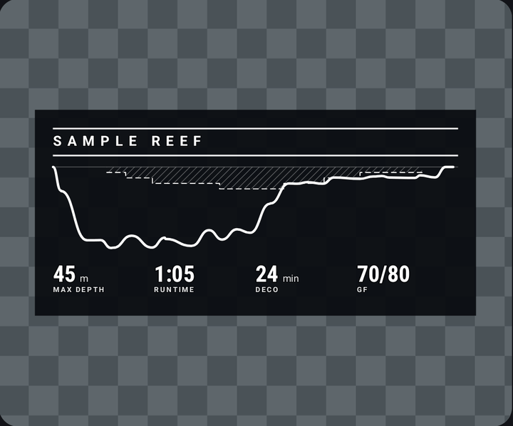<br><strong>Magazine</strong> · masthead rules and condensed figures, no card of its own</td>
</tr>
<tr>
<td align="center">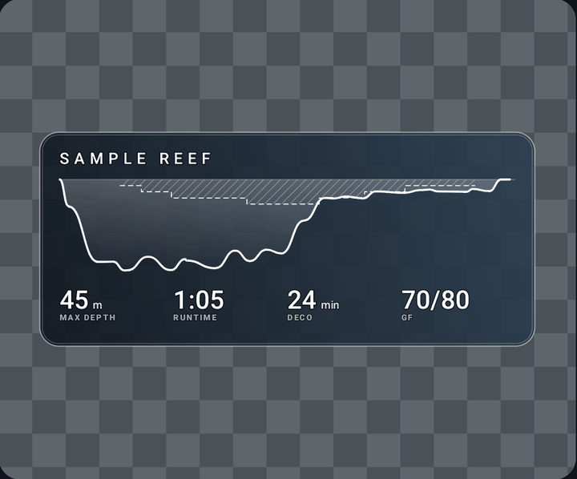<br><strong>Frosted</strong> · two-stop glass with a lit edge, smoked or misted</td>
<td align="center">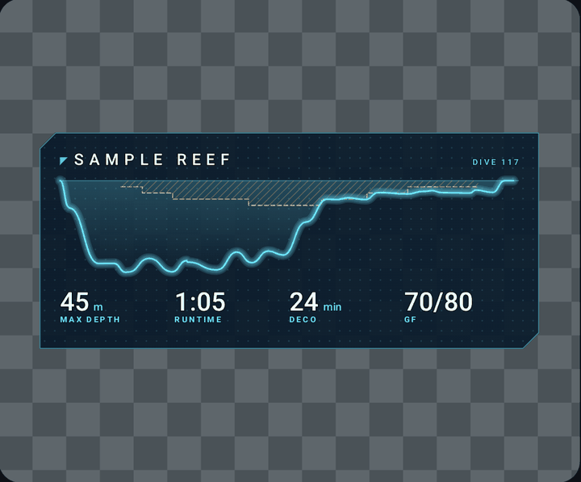<br><strong>HUD</strong> · a cut-cornered panel, a dot field, a trace that glows</td>
</tr>
<tr>
<td align="center">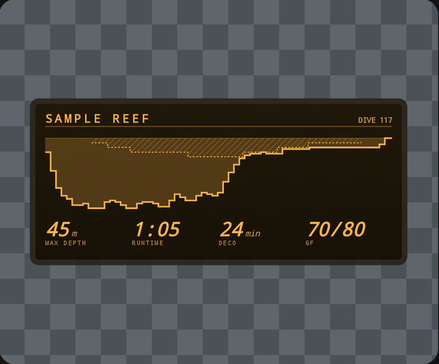<br><strong>Dive computer</strong> · a bezel and a segment screen, the trace drawn as steps</td>
<td align="center">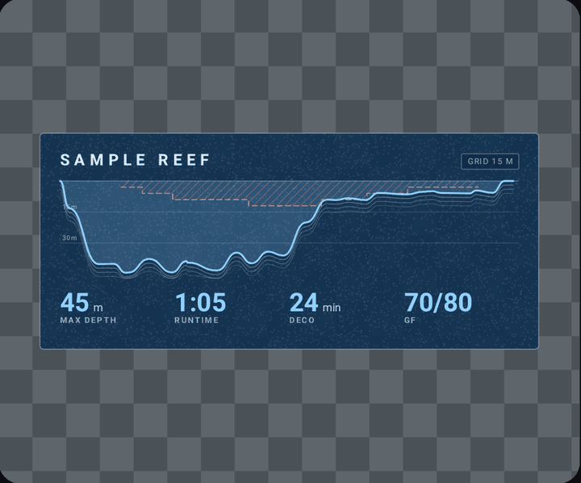<br><strong>Survey</strong> · grained paper, a labelled depth grid, hachures under the line</td>
</tr>
</table>

The profile is drawn as a smoothed curve by default, and **Smooth curve** in
Elements turns that off when you want every tooth of a sawtooth bottom rather
than a line through them. Dive computer is the one style that does not offer it:
its segment screen quantises the profile to one minute and one metre, and a
curve through a staircase is a staircase with rounded corners.

Type comes from Android's own families rather than bundled faces — the APK
carries no fonts.

## The figures

Left on **Auto**, the slate always shows max depth and runtime, then fills the
rest of the layout's budget with whichever of these your log can answer. Pick
them yourself instead whenever you would rather choose:

| key | shows | needs |
|---|---|---|
| `depth` | max depth, rounded up to the metre | samples |
| `time` | runtime, rounded up to the minute | samples |
| `deco` | time spent decompressing | a recorded ceiling |
| `gf` | gradient factors, e.g. `70/80` | a deco-model label containing them |
| `used` | gas consumed, litres | cylinder size + start and end pressure |
| `avg` | average depth | samples or the logged mean |
| `temp` | minimum water temperature | temperature samples |
| `sac` | surface air consumption | the log's own SAC field |
| `cns` | CNS toxicity percentage | the log's own CNS field |
| `gas` | mixes breathed, e.g. `Air, O2` | gas-switch events |

A value the log cannot supply is skipped rather than shown blank. A value too
wide for its column — a long list of mixes, mostly — is set smaller so it stays
inside it, rather than being dropped or left to run into its neighbour.

Slate figures round **up**: 44.4 m is a 45 m dive.

<details>
<summary><strong>Two of these are derived, not read</strong></summary>

<br>

**Deco time** is not a field in any log. It is computed as *from first reaching
the ceiling on the way up, until the obligation clears* — the hang. This is
deliberately not the same as the span during which deco was owed, which begins
the moment the ceiling leaves the surface, usually while you are still on the
bottom. On the reference dive those are 23 minutes and 50 minutes respectively,
and reporting the latter as "deco" would claim fifty minutes of stops that never
happened.

A dive that clears deco and re-incurs it served **two** hangs, and they are
summed — the cleared interval between them is never counted.

**Gradient factors** are recovered by pattern from a free-text deco-model label
(`GF 70/80`, `ZHL16C GF30/85`, `Buhlmann ZH-L16C + GF 30/85`). Anything that is
not a valid pair of percentages yields nothing rather than a guess — a VPM-B dive
has no gradient factors and must not appear to.

</details>

## Twenty-four palettes

Generated and machine-checked rather than chosen. Modern's nine are grouped by
the footage they are for:

| for dark footage | for pale backgrounds |
|---|---|
| `slate` `reef` `lagoon` `abyss` `twilight` `orchid` | `light` `paper` `ink` |

Each is derived from one base hue: that becomes the depth curve, and the
gas-switch accent is then found by searching the hue circle for the colour that
separates best from both the curve and the deco-ceiling red. The other seven
styles bring their own — a violet card and a yellow one, two panes of glass,
three dive-computer screens, and a cream survey sheet with a blueprint.

Every palette is validated for colour-vision-deficiency separation, chroma,
lightness and contrast before it ships — arithmetic that runs at design time, so
the app ships only the answers, and a palette that fails stops the build rather
than reaching a screen.

<details>
<summary><strong>Three sets of gates, not one</strong></summary>

<br>

"Passes" means nothing without saying which bar it cleared, so each palette
records its own:

- **chromatic** — the original bar. Modern's nine.
- **expressive** — a wider lightness band, and only for a style that paints its
  own opaque card. The band exists because a mark on a transparent slate lands
  on footage of unknown brightness; a style supplying its own background has
  already settled that. The colour-vision floors do not move.
- **monochrome** — for a palette that is one ink on purpose, like the segment
  screen or the masthead. Checks that measure difference *between* marks do not
  apply there, so the contrast floor turns strict in exchange, and what tells the
  ceiling from the profile is checked in the renderer instead: it must be hatched
  and dashed.

</details>

<details>
<summary><strong>Why Modern has no warm or green palettes</strong></summary>

<br>

Only hues from roughly **180° to 330°** work for a palette built the way
Modern's are — one hue sharing a picture with a fixed red ceiling. Warm and
green bases collide with that red: a green curve looks maximally different to
normal vision (ΔE 24) but measures **2.2** under protanopia, which is no
separation at all.

The sRGB gamut is also not a cylinder, so asking for a fixed chroma across hues
silently desaturates cyan below the floor. The generator sweeps for the
lightness at which each hue holds the most chroma instead.

</details>

<details>
<summary><strong>Why some styles re-colour the deco ceiling</strong></summary>

<br>

The ceiling used to be a fixed red everywhere, on the grounds that a hazard
colour which shifts with the palette stops reading as a hazard. It still is in
every Modern palette. But the colour was never carrying the hazard alone: the
region is hatched and its edge is a dashed step, and neither of those depends on
hue.

So a style may substitute — white on the violet card, amber on the HUD, screen
ink on the LCD — provided the substitute is *measured against the card it lands
on*. White on the yellow card came out at 1.43:1 and went back to a red. What
none of them may drop is the hatch or the dash, which is where the meaning went;
tests fail a style that tries.

</details>

## Get it

**[Download the latest APK](https://github.com/paul-charp/Dive-Slate/releases/latest)**
and open it. Android 10 or newer.

It is not on the Play Store, so your phone will ask once whether to allow
installs from wherever you opened the file — a browser or a file manager. Each
release also carries a `.sha256` beside the APK if you want to check the
download by hand.

**The app keeps itself up to date.** Once a day it asks GitHub whether a newer
release exists and offers it to you; the download is verified against the
checksum published in the release before Android is asked to install anything,
and a mismatch is refused rather than installed. Those two requests are the only
thing the app does with the network, and the only reason it asks for internet
access at all.

<details>
<summary><strong>Your phone may call this app unsafe, and here is why</strong></summary>

<br>

To install its own updates the app holds `REQUEST_INSTALL_PACKAGES`, and an app
that downloads a binary and asks to install it looks — as behaviour — exactly
like malware that does the same thing. Play Protect scores behaviour, not
intent, so a correctly signed release can be met with "Unsafe app blocked".

**More details → Install anyway** gets past that, and the `.sha256` on each
release lets you confirm you have the file this repository built.

If your phone blocks the install outright with no way through, that is Google's
enhanced fraud protection, which cannot be overridden — download the APK from
the release page in a browser instead.

</details>

### Getting a dive in

| from | how |
|---|---|
| **Subsurface-mobile** | Export the dive and pick Dive Slate in the share sheet |
| **A file on the phone** | Open it from the app, wherever it lives — several at once if you like |
| **Neither** | The bundled sample dive, to see what the app does |

| Format | Extensions | Notes |
| --- | --- | --- |
| Subsurface XML | `.ssrf`, `.xml` | sparse sample attributes are carried forward, as Subsurface itself does |
| UDDF 3.x | `.uddf`, `.xml` | SI units, namespace-agnostic; mandatory deco stops only |

Open more than one file and the dives stay grouped under the file they came
from. Nothing is merged or de-duplicated: two exports overlapping is an ordinary
accident, and dive numbers are per-logbook, so any attempt to spot a duplicate
across files would be a guess.

Detection reads file content, not the extension, so a renamed log still works.
Subsurface's own database cannot be read directly — Android denies it to other
apps — so the export is the only route in, not a workaround.

## Known gaps

- No background-media picker, so the palette cannot yet be judged against your
  own footage — only against the checkerboard.
- No library. Every incoming log is already copied to `filesDir/logs/`, and
  nothing ever reads that directory back, so re-rendering an old dive means
  exporting it from Subsurface again. Surfacing what is already being saved is
  the cheapest real improvement left.

## Build

```bash
cd android && ./gradlew :app:installDebug
```

Needs JDK 21 on `JAVA_HOME`, and the Android SDK — `ANDROID_HOME`, or `sdk.dir`
in `android/local.properties`. The wrapper fetches its own Gradle. Android Studio
is **not** required; it is only needed for the IDE and the emulator GUI.

```bash
cd android && ./gradlew core:test              # 87 tests, no device
cd android && ./gradlew :app:testDebugUnitTest # 30 more, also no device
cd android && ./gradlew :app:assembleRelease
```

With no keystore configured, `assembleRelease` signs with the **shared SDK debug
key** and says so. That is fine for putting a build on your own phone and no use
for distribution — an install signed with it can never be updated by a properly
signed one, because Android identifies an app by its signature. To sign for real,
put `storeFile`, `storePassword`, `keyAlias` and `keyPassword` in
`keystore.properties` at the repository root; it is gitignored, and the build
prints which key it used and which file configured it.

Releases are cut by pushing a `v*` tag; GitHub builds, signs, verifies and
publishes. [docs/RELEASING.md](docs/RELEASING.md) covers the keystore, the
repository secrets, and what each of the pipeline's refusals is protecting
against.

<details>
<summary><strong>Repository layout, and how the rendering is split</strong></summary>

<br>

```
android/       the app. core/ is plain Kotlin/JVM — units, models, both
               parsers, palettes, the styles and layouts — and builds with
               only a JDK. app/ is Compose, the Canvas painter, intents,
               export.

conformance/   the fixtures core/ is tested against: full parsed models for
               each log, a table-driven spec for the unit grammar, synthetic
               deco profiles, and the baked palettes. data/ holds the source
               logs those describe.

tools/         Python, design-time only. The palette maths and the scripts
               that bake it into android/.../Themes.kt, plus the check that
               the release manifest and the app still agree about its fields.
               Nothing here ships.

docs/          RELEASING.md, and the images this page uses.

.github/       CI on every push; a signed release on every v* tag.
```

`core` emits the slate as a **display list**, not as pixels, and `app` merely
paints it. That split is what makes the interesting code testable without a
device — including all of the geometry.

The palette code is Python because it is a **design instrument**: it exists to
prove a palette clears the gates, and having proved it for the nine presets, its
job is done. Porting it would mean shipping a colour-science library on a phone
to recompute a constant.

</details>

<details>
<summary><strong>Development notes</strong></summary>

<br>

`core:test` reads `conformance/`, so a fixture change invalidates the task rather
than reporting up to date — if a green run ever looks too good, `--rerun-tasks`
is the way to check.

Changing a palette means regenerating what the app ships:

```bash
uv run python tools/export_theme_tokens.py
uv run python tools/generate_kotlin_themes.py
```

Then `uv run pytest` to confirm the baked tokens still match the maths, and
`uv run ruff check . && uv run mypy tools`.

`CLAUDE.md` carries the rest: the handful of behaviours that are easy to break,
how a share intent actually arrives, and the reasoning behind decisions that
look arbitrary from the outside. Read it before changing parsing, palettes or
the intent filters.

</details>

## License

MIT
